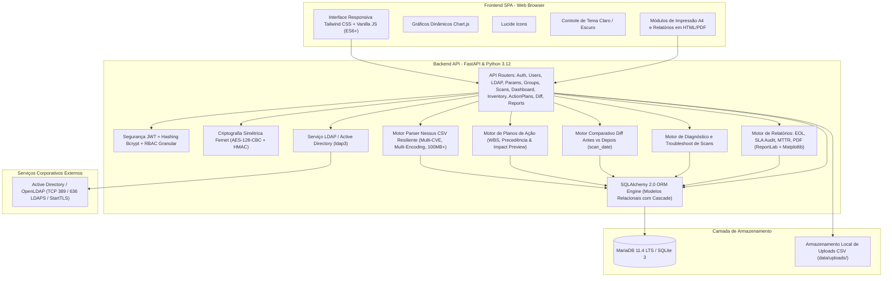

# 🛡️ GvulStand - Documentação de Funcionalidades e Requisitos Técnicos
**Sistema de Gestão e Governança de Vulnerabilidades de Segurança da Informação**  
*Conforme as normas ISO/IEC 27001:2022 (Controles 8.8), ISO/IEC 27002:2022, ISO 9001:2015 (Ciclo PDCA) e Tenable/Nessus CSV Integration*

---

## 1. Visão Geral e Contexto Executivo

### 1.1 O que é o GvulStand?
O **GvulStand** é uma plataforma corporativa web de alta performance voltada para a **Gestão de Vulnerabilidades Técnicas**, **Governança de Riscos Cibernéticos** e **Melhoria Contínua da Qualidade**. O sistema foi concebido para transformar dados brutos de varreduras de vulnerabilidades gerados por ferramentas líderes de mercado (especialmente a suíte **Tenable Nessus / Tenable Security Center / Tenable.io**) em painéis analíticos de tomada de decisão, indicadores normativos auditáveis, planos de ação estruturados (WBS) e fluxos formais de remediação rastreáveis.

### 1.2 Problema que o Sistema Resolve
1. **Sobrecarga de Dados (*Data Overload*):** Relatórios de varredura Nessus frequentemente contêm dezenas de milhares de linhas e múltiplos megabytes em CSV, inviabilizando a triagem manual e o acompanhamento gerencial por planilhas eletrônicas estáticas.
2. **Ausência de Linha de Base (*Baseline vs. Reteste*):** Dificuldade crônica em comprovar de maneira automatizada e analítica se as equipes de infraestrutura, desenvolvimento e sustentação efetivamente corrigiram as vulnerabilidades apontadas nas varreduras anteriores.
3. **Falta de Rastreabilidade e Auditoria (*Quem, Quando e Por Quê*):** Impossibilidade de demonstrar a auditores independentes e comitês de governança o histórico de tratativas, as justificativas formais de aceite temporário de risco e a conformidade tempestiva com os Acordos de Nível de Serviço (SLAs).
4. **Desconexão entre Vulnerabilidades e Projetos de Remediação:** Ausência de planos de ação formalizados (WBS) com divisão clara de tarefas, múltiplos responsáveis técnicos e controle de precedência entre correções gerais e intervenções específicas por host.
5. **Falhas Ocultas em Scans:** Varreduras que falham silenciosamente devido a bloqueios perimetrais de firewall (ICMP), falhas de credenciais em Windows (SMB/RPC) ou Linux (SSH), negação de acesso WMI ou falta de privilégios (`sudo`), induzindo a organização a um falso sentimento de segurança.

### 1.3 Alinhamento Normativo Internacional
- **ISO/IEC 27001:2022 & ISO/IEC 27002:2022 (Controle 8.8 – Gestão de Vulnerabilidades Técnicas):**
  - Obtenção sistemática e tempestiva de informações sobre vulnerabilidades técnicas em sistemas de informação.
  - Avaliação rigorosa da exposição da organização aos riscos e determinação de medidas mitigatórias apropriadas.
  - Acompanhamento do ciclo de vida de cada apontamento com registro formal de tratativas e justificativas obrigatórias de risco aceito.
- **ISO 9001:2015 (Ciclo PDCA – Melhoria Contínua da Qualidade):**
  - **Plan (Planejar):** Estabelecer a linha de base (*Baseline Scan*) e fixar metas e prazos de SLA por criticidade e grupo de ativos.
  - **Do (Executar):** Implementação de patches, planos de ação estruturados (WBS) e reconfigurações pelas equipes de sustentação.
  - **Check (Verificar):** Realização de varreduras de reteste (*Retest Scan*) e cruzamento analítico antes vs. depois, apurando a taxa de eficácia e a redução líquida de risco.
  - **Act (Agir):** Avaliação de vulnerabilidades persistentes e regressões, ajustando políticas de segurança, alocação de recursos e planos operacionais.

---

## 2. Arquitetura do Sistema e Tecnologias

### 2.1 Diagrama Arquitetural



### 2.2 Tecnologias Utilizadas

| Camada | Tecnologia | Versão | Finalidade Arquitetural |
| :--- | :--- | :---: | :--- |
| **Backend Framework** | FastAPI | 0.115.0 | Framework assíncrono moderno com documentação OpenAPI/Swagger nativa e validação estrita via Pydantic v2 |
| **Servidor ASGI** | Uvicorn | 0.30.6 | Servidor ASGI de alta performance para execução em ambientes de desenvolvimento e produção conteinerizada |
| **ORM & Abstração DB** | SQLAlchemy | 2.0.35 | Mapeamento relacional tipado com migrations idempotentes, suporte a transações ACID e consultas analíticas otimizadas |
| **Validação de Dados** | Pydantic | 2.9.2 | Validação e serialização de DTOs (*Data Transfer Objects*) com velocidade nativa em C/Rust |
| **Criptografia Simétrica** | Cryptography | 43.0.1 | Módulo Fernet (AES-128-CBC + HMAC-SHA256) para proteção de senhas de serviço em repouso no banco |
| **Autenticação JWT** | Python-Jose | 3.3.0 | Codificação e validação de tokens de acesso HMAC-SHA256 (`HS256`) com expiração de 24h configurável |
| **Hashing de Senhas** | Passlib + Bcrypt | 1.7.4 / 4.0.1 | Algoritmo Bcrypt com salt dinâmico e fator de custo adaptativo para proteção de credenciais locais |
| **Integração AD / LDAP** | ldap3 | 2.9.1 | Biblioteca cliente pura Python compatível com RFC 4511 para Active Directory e OpenLDAP (LDAP, LDAPS, StartTLS) |
| **Geração de PDF** | ReportLab | ≥ 4.2.0 | Renderização programática de documentos PDF em conformidade com as regras de diagramação corporativa |
| **Gráficos para PDF** | Matplotlib | ≥ 3.9.0 | Renderização de gráficos de alta resolução (*charts*) embutidos diretamente nos PDFs gerados |
| **Manipulação PDF** | PyMuPDF | ≥ 1.24.0 | Processamento, extração e inspeção de fluxos e estruturas PDF |
| **Conector de Banco** | PyMySQL | 1.1.1 | Driver MySQL/MariaDB para SQLAlchemy em ambiente de produção |
| **Banco Produção** | MariaDB | 11.4 LTS | Sistema gerenciador de banco de dados relacional corporativo com suporte a `utf8mb4` |
| **Banco Dev/Local** | SQLite | 3 | Armazenamento de arquivo local embutido para inicialização instantânea sem necessidade de containers |
| **Frontend UI** | HTML5 + Vanilla JS (ES6+) | Moderno | Single Page Application (SPA) modular e veloz, eliminando complexidade de build tools (Node.js/Webpack) |
| **Estilização** | Tailwind CSS | 3.x CDN | Design responsivo com paleta de cores harmonizada, suporte a temas Claro/Escuro e regras `@media print` A4 |
| **Gráficos da UI** | Chart.js | 4.x | Renderização interativa via Canvas de gráficos de pizza, roscas, barras, dispersão temporal e comparativos |
| **Iconografia** | Lucide Icons | Última | Ícones vetoriais modernos e limpos renderizados uniformemente em toda a aplicação |
| **Conteinerização** | Docker & Docker Compose | v2+ | Isolamento de ambiente com healthchecks automatizados e volumes persistentes |
| **Testes Automatizados** | pytest + HTTPX | 8.3.3 / 0.27.2 | Suíte automatizada de testes cobrindo todos os módulos do sistema |

---

## 3. Verificação de Funcionalidades e Auditoria de Testes

O sistema conta com validação formal contínua executada por suíte de testes automatizados (**pytest**), atingindo **100% de conformidade com 61 testes aprovados (61 de 61)**.

### 3.1 Execução da Suíte de Testes (61/61 Aprovados)

```text
============================= test session starts ==============================
platform linux -- Python 3.12.14, pytest-8.3.3, pluggy-1.6.0
collected 61 items

backend/tests/test_action_plans.py::test_action_plans_lifecycle_and_features PASSED [  1%]
backend/tests/test_action_plans.py::test_action_plan_creation_from_host_ip_and_plugin PASSED [  3%]
backend/tests/test_action_plans.py::test_action_plans_hierarchical_asset_group_filtering PASSED [  4%]
backend/tests/test_action_plans.py::test_action_plans_tags_and_multitagging PASSED [  6%]
backend/tests/test_action_plans.py::test_action_plans_matrix_scope_and_preview PASSED [  8%]
backend/tests/test_action_plans.py::test_action_plans_precedence_and_orphans PASSED [  9%]
backend/tests/test_action_plans.py::test_action_plan_rejection_for_non_existent_or_empty_host PASSED [ 11%]
backend/tests/test_action_plans.py::test_action_plan_rejection_for_non_existent_plugin PASSED [ 13%]
backend/tests/test_action_plans.py::test_action_plan_matrix_strict_bipartite_validation PASSED [ 14%]
backend/tests/test_action_plans.py::test_action_plan_deletion_reverts_vulnerabilities_to_open_and_logs PASSED [ 16%]
backend/tests/test_action_plans.py::test_action_plan_wizard_endpoints_and_hosts_without_plugin PASSED [ 18%]
backend/tests/test_action_plans.py::test_action_plan_wizard_multiple_plugins_selection PASSED [ 19%]
backend/tests/test_all.py::test_nessus_parser_unit PASSED                         [ 21%]
backend/tests/test_all.py::test_tenable_official_semicolon_csv PASSED             [ 22%]
backend/tests/test_all.py::test_unquoted_newlines_and_mixed_endings PASSED        [ 24%]
backend/tests/test_all.py::test_login_default_admin PASSED                        [ 26%]
backend/tests/test_all.py::test_login_invalid_credentials PASSED                  [ 27%]
backend/tests/test_all.py::test_create_user_and_auth PASSED                       [ 29%]
backend/tests/test_all.py::test_scan_upload_and_dashboard PASSED                  [ 31%]
backend/tests/test_all.py::test_exploit_verdadeiro_falso_and_info_exclusion PASSED [ 32%]
backend/tests/test_all.py::test_scan_diagnostics_troubleshooting PASSED           [ 34%]
backend/tests/test_all.py::test_multiple_mac_addresses_and_cvss_formats PASSED   [ 36%]
backend/tests/test_all.py::test_aging_breakdown_and_treatment_audit_trail PASSED  [ 37%]
backend/tests/test_all.py::test_first_found_date_formats_and_aging_calculation PASSED [ 39%]
backend/tests/test_all.py::test_tenable_dashboard_widgets_metrics PASSED          [ 40%]
backend/tests/test_all.py::test_bulk_vulnerability_treatment PASSED               [ 42%]
backend/tests/test_all.py::test_comparative_diff_excludes_info_and_none PASSED    [ 44%]
backend/tests/test_all.py::test_multi_cve_aggregation_in_parser_and_upload PASSED [ 45%]
backend/tests/test_all.py::test_parent_and_subgroup_management_and_filtering PASSED [ 47%]
backend/tests/test_all.py::test_plugin_solution_and_affected_hosts PASSED          [ 49%]
backend/tests/test_all.py::test_rbac_user_management PASSED                       [ 50%]
backend/tests/test_all.py::test_rbac_asset_group_permissions PASSED               [ 52%]
backend/tests/test_all.py::test_rbac_scan_import_and_deletion PASSED              [ 54%]
backend/tests/test_all.py::test_rbac_vulnerability_treatment_and_auditing PASSED  [ 55%]
backend/tests/test_all.py::test_scan_date_and_free_comparative_selection PASSED   [ 57%]
backend/tests/test_all.py::test_vulnerabilities_host_filter_and_unique_hosts PASSED [ 59%]
backend/tests/test_all.py::test_asset_group_scoped_permissions_and_scan_deletion PASSED [ 60%]
backend/tests/test_all.py::test_multilevel_asset_group_hierarchy_and_rbac PASSED  [ 62%]
backend/tests/test_inventory.py::test_inventory_endpoint PASSED                   [ 63%]
backend/tests/test_ldap.py::test_ldap_config_rbac PASSED                          [ 65%]
backend/tests/test_ldap.py::test_ldap_config_get_and_update PASSED                [ 67%]
backend/tests/test_ldap.py::test_ldap_test_connection_mocked PASSED               [ 68%]
backend/tests/test_ldap.py::test_ldap_validate_user_endpoint PASSED               [ 70%]
backend/tests/test_ldap.py::test_create_ldap_user_and_authenticate PASSED        [ 72%]
backend/tests/test_ldap.py::test_ldap_disabled_prevents_login_and_creation PASSED [ 73%]
backend/tests/test_ldap.py::test_ldap_bind_password_is_encrypted_at_rest PASSED  [ 75%]
backend/tests/test_parameters.py::test_get_default_parameters PASSED              [ 77%]
backend/tests/test_parameters.py::test_list_timezones_endpoint PASSED             [ 78%]
backend/tests/test_parameters.py::test_update_parameters_rbac_analyst_denied PASSED [ 80%]
backend/tests/test_parameters.py::test_update_parameters_validation_errors PASSED [ 81%]
backend/tests/test_parameters.py::test_preview_ignored_vulnerabilities PASSED     [ 83%]
backend/tests/test_parameters.py::test_ignored_vulnerabilities_excluded_from_indicators PASSED [ 85%]
backend/tests/test_parameters.py::test_apply_slas_to_all_groups PASSED            [ 86%]
backend/tests/test_reports.py::test_get_report_templates PASSED                   [ 88%]
backend/tests/test_reports.py::test_get_executive_summary_empty PASSED            [ 90%]
backend/tests/test_reports.py::test_get_executive_summary_with_scan_and_custom_params PASSED [ 91%]
backend/tests/test_reports.py::test_get_executive_summary_empty_query_strings PASSED [ 93%]
backend/tests/test_reports.py::test_get_technical_report_empty PASSED             [ 95%]
backend/tests/test_reports.py::test_get_technical_report_with_data PASSED         [ 96%]
backend/tests/test_reports.py::test_sla_audit_report_template_and_empty PASSED    [ 98%]
backend/tests/test_reports.py::test_sla_audit_report_full_with_aging_pdca_and_accepted_risks PASSED [100%]

====================== 61 passed, 339 warnings in 26.40s =======================
```

### 3.2 Matriz de Rastreabilidade e Cobertura Funcional

| Módulo / Funcionalidade | Escopo Técnico do Teste | Arquivo de Teste | Status |
| :--- | :--- | :--- | :---: |
| **Parser Nessus Oficial** | Delimitadores `;`, `,`, `\t` e `\|` em arquivos brutos | `test_all.py` | ✅ Aprovado |
| **Resiliência a Quebras de Linha** | Costura de campos multilinhas sem aspas (*Stitching*) | `test_all.py` | ✅ Aprovado |
| **Agregação Multi-CVE** | Unificação automática de múltiplos CVEs em chave única | `test_all.py` | ✅ Aprovado |
| **Tolerância CVSS** | Escala decimal (`7.5`), inteira (`75`), vírgula flutuante e fallbacks | `test_all.py` | ✅ Aprovado |
| **Detecção de Exploits** | Reconhecimento de `True`/`False`, `Sim`/`Não`, `Verdadeiro`/`Falso` e Metasploit | `test_all.py` | ✅ Aprovado |
| **Autenticação JWT Local** | Emissão de tokens, expiração de 24h e bloqueio de credenciais incorretas | `test_all.py` | ✅ Aprovado |
| **Autenticação Corporativa AD/LDAP**| Autenticação transparente com contas de rede e sincronização de dados | `test_ldap.py` | ✅ Aprovado |
| **Criptografia Fernet em Repouso** | Senha do bind LDAP criptografada no banco e mascarada na API | `test_ldap.py` | ✅ Aprovado |
| **RBAC: Gestão de Usuários** | Operações restritas ao perfil `admin` com bloqueio HTTP 403 para analistas | `test_all.py` | ✅ Aprovado |
| **RBAC: Gestão de Scans** | Upload por analista/admin e bloqueio de exclusão para analistas | `test_all.py` | ✅ Aprovado |
| **RBAC: Tratativa ISO 27001** | Tratamento liberado a analistas/admin e bloqueado para auditores (HTTP 403) | `test_all.py` | ✅ Aprovado |
| **RBAC Granular por Grupo** | Validação das permissões `can_treat`, `can_import` e `can_author` | `test_all.py` | ✅ Aprovado |
| **Hierarquia de Grupos em Árvore** | Árvore multinível de ativos com cálculo recursivo e sem ciclos | `test_all.py` | ✅ Aprovado |
| **Dashboard Executivo & KPIs** | Cálculo de Risco ISO 27001, Eficácia ISO 9001, VPR e Aging | `test_all.py` | ✅ Aprovado |
| **Inventário Geral de Hosts** | Consulta paginada, busca textual, filtros de severidade e agregação de score | `test_inventory.py` | ✅ Aprovado |
| **Planos de Ação (WBS & Ciclo)** | Criação, acompanhamento de tarefas, tags e encerramento automatizado | `test_action_plans.py` | ✅ Aprovado |
| **Precedência ISO 27001 em Planos** | Planos de Host sobrepõem planos de vulnerabilidade com log de auditoria | `test_action_plans.py` | ✅ Aprovado |
| **Escopo Matricial N:N** | Associação de múltiplos hosts e plugins com validação relacional estrita | `test_action_plans.py` | ✅ Aprovado |
| **Assistente Wizard de Planos** | Candidatos de hosts e plugins retornados corretamente para a UI | `test_action_plans.py` | ✅ Aprovado |
| **Reversão de Órfãos em Planos** | Reversão segura de vulnerabilidades para status `Open` ao excluir planos | `test_action_plans.py` | ✅ Aprovado |
| **Comparativo Antes vs. Depois** | Diff quádruplo, identificação de regressões e cálculo de eficácia PDCA | `test_all.py` | ✅ Aprovado |
| **Diagnóstico Scan Health** | Detecção e orientação prescritiva para falhas de ICMP, SMB, SSH e WMI | `test_all.py` | ✅ Aprovado |
| **Configuração de Fusos Horários** | Suporte completo a fusos brasileiros/internacionais via `zoneinfo` | `test_parameters.py` | ✅ Aprovado |
| **Expurgo de Falso-Positivo** | Exclusão automática de IDs ignorados em todos os indicadores do sistema | `test_parameters.py` | ✅ Aprovado |
| **Relatório Sumário Executivo** | Geração de sumário para C-Level com detecção algorítmica de SO em EOL | `test_reports.py` | ✅ Aprovado |
| **Relatório Técnico Detalhado** | Dossiê exaustivo ativo por ativo com portas, evidências e soluções | `test_reports.py` | ✅ Aprovado |
| **Relatório de Auditoria SLA** | Avaliação formal do Controle 8.8, riscos aceitos e vulnerabilidades vencidas | `test_reports.py` | ✅ Aprovado |

---

## 4. Mapeamento Detalhado de Módulos e Funcionalidades

### 4.1 Módulo de Autenticação, RBAC e Segurança de Dados
O sistema implementa uma camada de segurança em profundidade (*Defense-in-Depth*), combinando autenticação moderna baseada em tokens, controle de acesso granular e criptografia em repouso.

- **Credenciais de Fábrica (Seed Idempotente):**
  - **Administrador:** `Admin` / `Admin`
  - **Analista de Segurança:** `analista` / `analista`
  - **Auditor ISO:** `auditor` / `auditor`
- **Perfis Globais de Acesso:**
  1. **Administrador (`admin`):** Acesso irrestrito a todas as áreas operacionais, administrativas e gerenciais, incluindo exclusão definitiva de dados, parametrizações globais e configuração de identidades.
  2. **Analista de Segurança (`analyst`):** Perfil técnico de operação: importação de scans, tratamento de vulnerabilidades, gestão completa de planos de ação (WBS), execução de comparativos de eficácia e emissão de relatórios. Sem permissão de exclusão estrutural ou gestão de usuários.
  3. **Auditor ISO (`auditor`):** Perfil de auditoria e conformidade em modo estritamente **somente leitura**. Possui acesso visual a todos os dashboards, inventários, relatórios e planos de ação, porém com bloqueio sistemático (interface e HTTP 403) para qualquer alteração cadastral ou tratativa de risco.
- **RBAC Granular por Grupo de Ativos (`UserAssetGroup`):**
  - Permite segmentar a governança de modo que um analista atue apenas nos grupos sob sua responsabilidade:
    - `can_treat`: Permissão para registrar tratativas de vulnerabilidades no grupo.
    - `can_import`: Permissão para realizar o upload e ingestão de relatórios de varredura no grupo.
    - `can_author`: Permissão formal para emitir relatórios técnicos e executivos em nome do grupo.
- **Criptografia Simétrica em Repouso (`crypto_utils.py`):**
  - Senhas de serviço (como a `bind_password` utilizada para conectar ao Active Directory) são criptografadas antes da gravação no banco utilizando **Fernet (AES-128-CBC + HMAC-SHA256)**, com chave derivada deterministicamente da `SECRET_KEY` da aplicação via SHA-256.
  - A API nunca retorna a senha de serviço em texto claro, utilizando sempre a máscara `********`.

### 4.2 Motor de Ingestão e Parser Nessus CSV Resiliente
Desenvolvido especificamente para processar com extrema velocidade e resiliência arquivos CSV exportados do Tenable Nessus, Tenable.sc e Tenable.io, inclusive relatórios corporativos que superam 100 MB.

- **Eliminação de Limites de Memória:** O parser eleva o teto padrão do Python através de `csv.field_size_limit(sys.maxsize)`, evitando exceções de estouro de campo comuns em scanners com grandes blocos de texto.
- **Detecção Heurística de Delimitadores:** Analisa a primeira linha do arquivo e identifica se a separação foi feita por ponto e vírgula (`;`), vírgula (`,`), tabulação (`\t`) ou barra vertical (`|`).
- **Tolerância Multi-Encoding:** Tenta decodificar o arquivo sequencialmente em UTF-8, UTF-8-BOM (gerado frequentemente pelo Excel e Windows), Latin-1 (ISO-8859-1) e CP1252.
- **Motor de Costura de Quebras de Linha (*Stitching Engine*):** Varreduras Nessus que contêm quebras de linha cruas (não escapadas) dentro de campos como `Plugin Output`, `Description` ou `Synopsis` têm suas linhas reconstruídas automaticamente através do reconhecimento da expressão regular de início de registro (`r'^\s*"?\d+"?\s*;'`), garantindo que o CSV não se corrompa.
- **Dicionário Flexível de Cabeçalhos:** Mapeia mais de 30 variações em português e inglês para colunas como *Plugin ID*, *CVE*, *CVSS v3/v2*, *Severity/Risk*, *IP Address*, *Host*, *MAC Address*, *Operating System*, *Exploit Available*, *First Found* e *Last Found*.
- **Agregação e Deduplicação Multi-CVE:** Quando um mesmo plugin refere-se a múltiplos CVEs ou quando o scanner lista a vulnerabilidade em múltiplas linhas, o sistema agrega todos os CVEs únicos e consolida a ocorrência pela chave unívoca `Host IP + Plugin ID + Porta + Protocolo`, elegendo o maior score CVSS/VPR.
- **Autodetecção de Sistema Operacional:** Caso a coluna de SO do cabeçalho esteja em branco, o parser analisa saídas de plugins de inventário (11936, 10287 e 45590) e preenche automaticamente o sistema operacional do host.
- **Desacoplamento de Data (`scan_date`):** O operador pode informar a data real em que o scanner rodou, permitindo ordenar cronologicamente históricos de análises sem misturar com a data do upload.

### 4.3 Painel Executivo (Dashboard) e KPIs de Governança
O dashboard é orientado ao scan mais recente de cada Grupo de Ativos cadastrado no sistema (ou grupos sob alçada do usuário logado), evitando duplicidade estatística de scans legados.

- **Cards de Severidade:** Contadores quantitativos de vulnerabilidades Críticas, Altas, Médias, Baixas e Informativas.
- **Cards de Governança do Ciclo de Vida:** Apresenta a quantidade de vulnerabilidades nos status `Open`, `In_Action_Plan`, `In_Remediation`, `Accepted_Risk` e `Remediated`, com desdobramento por criticidade.
- **Métricas Tenable VPR:** Visualização por faixa de severidade dinâmica (9.0–10.0, 7.0–8.9, 4.0–6.9 e 0.0–3.9).
- **Aging de Vulnerabilidades:**
  - Segmentação padrão de aging: 0–30 dias, 31–60 dias, 61–90 dias e acima de 90 dias.
  - Matriz de Aging em 6 buckets temporais: 0–7d, 8–14d, 15–30d, 31–60d, 61–90d e >90d cruzados com a severidade.
- **SLA Progress:** Medidor percentual e quantitativo de itens que estão dentro do prazo estipulado pela política (*Meeting*) contra itens já vencidos (*Not Meeting*).
- **Scan Health & Cobertura de Credenciais:** Mapeamento dedupado por host identificando a efetividade das credenciais utilizadas durante a varredura.
- **Vetores de Exploração:** Identificação de ameaças com malware ativo, exploits em ferramentas públicas (Metasploit, etc.) e segregação de exploração remota vs. local.
- **Top 100 Vulnerabilidades Críticas:** Listagem priorizada por exploit disponível, CVSS v3 e quantidade de hosts afetados, com modal completo de solução recomendada pelo fabricante e lista de hosts atingidos.
- **Top 20 Hosts com Exploits:** Destaca os ativos que concentram o maior número de vulnerabilidades exploráveis publicamente, auxiliando na priorização imediata do SOC.

### 4.4 Módulo de Inventário Geral de Hosts & Ativos
Fornece à equipe de segurança e sustentação uma visão centralizada e paginada de todos os ativos descobertos no ambiente tecnológico:

- **Listagem Estruturada:** Exibe Endereço IP, Hostname/FQDN, Sistema Operacional completo, contadores individuais por severidade (Crítica, Alta, Média, Baixa) e o **Host Risk Score** individual ponderado.
- **Métricas Gerais do Parque:**
  - Total de ativos mapeados e total de vulnerabilidades acumuladas.
  - Médias e máximas de pontuação de risco entre os hosts.
  - Quantidade absoluta de hosts com vulnerabilidades críticas e hosts expostos a exploits conhecidos.
- **Pesquisa e Filtros:** Busca textual universal em tempo real (por IP, hostname, versão de SO ou grupo de ativos), filtro rápido por nível de severidade (Hosts Críticos, Altos, com Exploits) e ordenação dinâmica por qualquer coluna.
- **Rastreabilidade de Projetos:** Conexão direta indicando se o ativo já possui um Plano de Ação ativo atribuído a ele.

### 4.5 Módulo de Planos de Ação (Action Plans / WBS / Ciclo PDCA)
O módulo de **Planos de Ação** representa o núcleo de orquestração de remediação do GvulStand, integrando a engenharia de segurança à metodologia de projetos e ao ciclo de melhoria contínua da qualidade (ISO 9001 e Controle 8.8 da ISO 27001):

- **Tipos de Escopo de Remediação:**
  1. **Por Host (`HOST`):** Focado em remediar todas as falhas de um servidor ou endpoint de alto risco.
  2. **Por Vulnerabilidade (`VULNERABILITY`):** Focado na mitigação em massa de um CVE ou Plugin específico em toda a rede.
  3. **Por Grupo de Ativos (`GROUP`):** Focado em um departamento, cluster ou zona de rede específica.
  4. **Customizado (`CUSTOM`):** Agrupamento livre definido pelo analista de segurança.
  5. **Matricial N:N (`MATRIX_NN`):** Associação bipartida de múltiplos hosts selecionados a múltiplos plugins específicos, validando de forma estrita que cada host possua ao menos um dos plugins informados e que cada plugin afete ao menos um dos hosts informados.
- **Estrutura Analítica de Tarefas (WBS - *Work Breakdown Structure*):**
  - Permite decompor o plano de ação em etapas sequenciais com índice de ordem (`order_index`).
  - Atribuição de responsável técnico direto (`assigned_user_id`), data de início, prazo final (`due_date`) e status da tarefa (`TODO`, `DOING`, `REVIEW`, `DONE`, `BLOCKED`).
  - Cálculo automático da taxa de conclusão do projeto (`progress_percent`) e sinalização de tarefas vencidas (*overdue*).
- **Vínculo Exclusivo & Regra de Precedência ISO 27001:**
  - Uma vulnerabilidade ativa só pode estar associada a um único plano de ação em andamento simultaneamente.
  - **Precedência do Host:** Planos direcionados a um Host específico possuem prioridade hierárquica sobre planos genéricos de Vulnerabilidade/Plugin. Ao incluir um host em um plano de host, as vulnerabilidades daquele host vinculadas a planos genéricos são automaticamente reatribuídas ao plano de host, com registro formal na trilha de auditoria.
- **Transição de Estados e Reversão Segura de Órfãos:**
  - Ao vincular vulnerabilidades a um plano, seu status no inventário transita de `Open` para `In_Action_Plan`.
  - Caso o plano de ação seja cancelado ou excluído, todas as vulnerabilidades que estavam associadas e não possuem outro plano ativo são automaticamente revertidas para o status inicial `Open`, com registro formal na trilha de auditoria.
- **Multi-Tagging Transversal:** Permite associar etiquetas coloridas personalizadas aos planos de ação para classificação regulatória ou estratégica (ex: `SOX`, `PCI-DSS`, `LGPD`, `RedTeam`, `Urgente`).
- **Simulação Prévia de Impacto (`/action-plans/preview-impact`):** Endpoint analítico que recebe o escopo proposto e calcula, antes da persistência no banco, o percentual estimado de redução de risco e a relação exata de ativos e vulnerabilidades impactadas.

### 4.6 Motor Comparativo Antes vs. Depois (Eficácia & Diff PDCA ISO 9001)
Permite demonstrar de forma matemática a efetividade das ações de remediação entre varreduras consecutivas:

- **Comparação Livre:** Seleção de quaisquer dois scans pertencentes a um mesmo grupo de ativos (Scan Baseline / Antes vs. Scan de Reteste / Depois).
- **Cruzamento Quádruplo Estrito:** Compara registros utilizando a assinatura `Host IP + Plugin ID + Porta + Protocolo`.
- **Categorização Normativa:**
  - 🟢 **Remediadas (*Remediated*):** Apontamentos que existiam na linha de base inicial e desapareceram no reteste (comprovando a eficácia da equipe de infraestrutura).
  - 🟡 **Persistentes (*Persisting*):** Apontamentos que continuam presentes em ambas as varreduras, exigindo cobrança formal de SLA e auditoria de justificativas.
  - 🔴 **Novas / Regressões (*New*):** Apontamentos que não existiam no baseline e foram detectados no reteste (regressões de segurança decorrentes de novas configurações ou atualizações defeituosas).
- **Métricas Oficiais de Eficácia:**
  - **Taxa de Resolução (%):** Proporção de vulnerabilidades corrigidas em relação ao baseline.
  - **Redução Líquida de Risco (%):** Comparação entre o somatório de risco ponderado antes e depois da intervenção técnica.

### 4.7 Explorador de Vulnerabilidades & Histórico de Auditoria Imutável
- **Filtros Avançados:** Pesquisa textual (CVE, plugin, IP), filtro de severidade, filtro de exploits (*Sim*, *Não*, *Todos*), status de tratamento, ativo/host, grupo e scan.
- **Tratamento Individual e em Lote (*Bulk Treatment*):** Alteração de status com obrigatoriedade incondicional de preenchimento de nota justificativa de auditoria.
- **Histórico Imutável de Tratativas (`VulnerabilityTreatmentHistory`):** Tabela relacional dedicada que guarda cada evento de modificação de tratamento, contendo: `vulnerability_id`, `treatment_status`, `treatment_notes`, `changed_by_username` e `changed_at`.
- **Integração com Planos:** Exibição do identificador e título do Plano de Ação ativo a que a vulnerabilidade pertence.

### 4.8 Grupos de Ativos & Hierarquia em Árvore Multinível
- **Estrutura Hierárquica em Árvore:** Suporte a múltiplos níveis de profundidade utilizando autorreferência (`parent_id`), permitindo modelar corporações complexas (ex: *Diretoria > Datacenter Principal > Servidores de Banco de Dados*).
- **Prevenção de Ciclos:** Validação algorítmica recursiva (`is_descendant_of`) que impede referências circulares em qualquer nível da árvore.
- **Herança e Agregação de Métricas:** Grupos superiores consolidam automaticamente as estatísticas de scans, hosts e vulnerabilidades de todos os seus subgrupos descendentes.
- **SLAs Específicos por Grupo:** Cada grupo pode possuir limites próprios de SLA para Críticas, Altas, Médias e Baixas, adequando-se ao apetite de risco da respectiva área de negócio.

### 4.9 Central de Relatórios Executivos & Auditoria (3 Modelos + PDF)
A central de relatórios permite parametrizar o título, escopo, período de análise, equipe emissora e classificação da informação:

1. **Modelo 1 — Relatório Sumário de Gestão de Vulnerabilidades (`executive_summary`):**
   - Apresentação executiva para C-Level e Conselho de Administração.
   - Diagnóstico automatizado de sistemas operacionais em **Fim da Vida Útil (EOL)** com base em regras de descontinuação de fabricantes.
   - Termômetro de risco organizacional, indicador de superfície de ataque e tendência vs. ciclo anterior.
   - Top 5 vulnerabilidades prioritárias e métricas de cumprimento de prazos de remediação (SLA e MTTR).
2. **Modelo 2 — Relatório Técnico Detalhado de Vulnerabilidades & Hosts (`technical_inventory`):**
   - Dossiê ativo por ativo voltado às equipes técnicas de infraestrutura e SOC.
   - Mapeamento exaustivo de portas de rede TCP/UDP, CVEs associados, scores CVSS, saídas brutas de plugins (*Plugin Output*) e instruções oficiais de remediação.
3. **Modelo 3 — Relatório de Auditoria e Conformidade SLA ISO 27001 (`sla_audit`):**
   - Auditoria formal de atendimento ao Controle 8.8 da ISO/IEC 27001 e Ciclo PDCA da ISO 9001.
   - Aderência percentual aos SLAs por faixa de severidade e matriz de aging temporal.
   - **Trilha de Riscos Aceitos:** Seção dedicada que isola todas as vulnerabilidades mantidas em `Accepted_Risk`, exibindo a nota de justificativa, quem aprovou e a data da homologação.
   - Apuração detalhada de vulnerabilidades em atraso (*Breached*) com indicação de dias excedentes e plano recomendado.
- **Geração e Impressão:** Visualização em janelas especializadas com controles de impressão A4 (`@media print`) e geração programática de arquivos PDF de alta resolução via **ReportLab** e **Matplotlib**.

### 4.10 Diagnóstico & Troubleshoot de Scans (Scan Health)
O sistema mapeia e isola automaticamente os plugins de erro do Nessus, oferecendo um guia técnico prescritivo para resolução de impedimentos de coleta:
- **Rede / ICMP (Plugins 1102, 10180):** Alerta para hosts que não responderam ao ping ICMP Echo devido a bloqueios de firewall perimetral.
- **Autenticação Windows / SMB (Plugin 24786) e WMI (Plugin 104410):** Aponta credenciais administrativas inválidas ou portas 445/DCOM bloqueadas no firewall local do Windows.
- **Autenticação SSH Linux (Plugins 12650, 21745) e Escalação Sudo (Plugins 102094, 102095):** Identifica contas sem permissão de superusuário para coletar patches locais.
- **Scans Interrompidos (Plugin 26917):** Sinaliza varreduras abortadas por estouro da janela operacional.

### 4.11 Integração LDAP / Active Directory & Criptografia em Repouso
- **Configuração Centralizada:** Painel administrativo para parametrização de Host/IP, Porta (389 ou 636 LDAPS), StartTLS, Base DN e filtros de busca customizados.
- **Validação em Tempo Real:** Endpoint `/api/ldap/validate-user` para checagem imediata de existência do usuário no domínio corporativo via `sAMAccountName`.
- **Criptografia Simétrica de Senhas:** A senha de bind do LDAP é criptografada em repouso com algoritmo Fernet (AES-128) e nunca é exposta na API em texto puro.

### 4.12 Gestão de Usuários
- **Administração Centralizada:** Criação, edição, ativação/inativação e exclusão de contas com proteção nativa contra exclusão acidental do último administrador ativo.
- **Suporte Híbrido:** Usuários manuais locais com senha Bcrypt ou contas de rede corporativas autenticadas via Active Directory.
- **Gestão de Acessos RBAC:** Atribuição de perfis globais (`admin`, `analyst`, `auditor`) e controle fino de permissões por grupo de ativos.

### 4.13 Parâmetros Globais do Sistema (Administração Pontual)
- **Fuso Horário Operacional (`timezone`):**
  - Define o fuso horário oficial utilizado para carimbar todas as operações de auditoria, relatórios técnicos e emissões de PDF.
  - Suporte completo aos fusos brasileiros (`America/Sao_Paulo`, `America/Manaus`, `America/Belem`, `America/Fortaleza`, `America/Recife`, `America/Cuiaba`, `America/Porto_Velho`, `America/Rio_Branco`, `America/Boa_Vista`, `America/Noronha`) e internacionais, com componente de relógio ao vivo (*Live Clock*).
- **Prazos Globais Padrão de SLA:**
  - Parametrização em dias para Críticas, Altas, Médias e Baixas, com ferramenta de replicação em lote para todos os grupos de ativos.
- **Expurgo Automático de Falsos-Positivos (`ignored_vulnerability_ids`):**
  - Lista delimitada de IDs de plugins ou vulnerabilidades que são automaticamente desconsideradas de todos os cálculos de indicadores, dashboards, relatórios, auditorias de SLA e comparativos diff.
  - Recurso de **Pré-visualização de Impacto (`preview-ignored`)** que simula em tempo real a quantidade de ocorrências excluídas antes de salvar a configuração.

---

## 5. Modelos de Dados e Estrutura Relacional (ORM)

```text
User
├── id (PK)
├── username (String 50, Unique, Index)
├── email (String 100, Unique, Index)
├── full_name (String 100)
├── hashed_password (String 255)
├── role (String 30: 'admin', 'analyst', 'auditor')
├── is_active (Boolean)
├── auth_type (String 20: 'local', 'ldap')
├── sam_account_name (String 100, Index)
├── created_at / updated_at (DateTime UTC)
└── asset_group_permissions (1:N → UserAssetGroup)

AssetGroup
├── id (PK)
├── name (String 100, Unique, Index)
├── description (Text)
├── network_range (String 255)
├── owner (String 100)
├── sla_critical_days, sla_high_days, sla_medium_days, sla_low_days (Integer)
├── parent_id (FK → AssetGroup.id, OnDelete SET NULL, Index)
├── created_at / updated_at (DateTime UTC)
├── parent (N:1 → AssetGroup)
├── subgroups (1:N → AssetGroup)
├── scans (1:N → Scan, Cascade Delete)
├── hosts (1:N → Host, Cascade Delete)
├── vulnerabilities (1:N → Vulnerability, Cascade Delete)
└── user_permissions (1:N → UserAssetGroup, Cascade Delete)

UserAssetGroup
├── id (PK)
├── user_id (FK → User.id, OnDelete CASCADE, Index)
├── asset_group_id (FK → AssetGroup.id, OnDelete CASCADE, Index)
├── can_treat (Boolean)
├── can_import (Boolean)
├── can_author (Boolean)
└── created_at (DateTime UTC)
[UNIQUE INDEX: user_id + asset_group_id]

Scan
├── id (PK)
├── asset_group_id (FK → AssetGroup.id, OnDelete CASCADE, Index)
├── scan_name (String 150)
├── scan_type (String 50: 'baseline', 'retest')
├── filename (String 255)
├── file_size_bytes (Integer)
├── total_hosts, total_findings (Integer)
├── critical_count, high_count, medium_count, low_count, info_count (Integer)
├── exploitable_critical_count (Integer)
├── scan_date (DateTime UTC - Data real da varredura)
├── created_at (DateTime UTC - Data do upload)
├── notes (Text)
├── hosts (1:N → Host, Cascade Delete)
└── vulnerabilities (1:N → Vulnerability, Cascade Delete)

Host
├── id (PK)
├── scan_id (FK → Scan.id, OnDelete CASCADE, Index)
├── asset_group_id (FK → AssetGroup.id, OnDelete CASCADE, Index)
├── ip_address (String 100, Index)
├── hostname, netbios_name (String 255)
├── mac_address, os (Text / String 500)
├── critical_count, high_count, medium_count, low_count, info_count (Integer)
├── exploitable_critical_count (Integer)
├── risk_score (Float)
└── vulnerabilities (1:N → Vulnerability, Cascade Delete)
[INDEX: scan_id + ip_address]

Vulnerability
├── id (PK)
├── scan_id (FK → Scan.id, OnDelete CASCADE, Index)
├── host_id (FK → Host.id, OnDelete CASCADE, Index)
├── asset_group_id (FK → AssetGroup.id, OnDelete CASCADE, Index)
├── plugin_id (String 50, Index)
├── plugin_name (String 500)
├── cve (Text)
├── cvss_v3, cvss_v2, vpr (Float)
├── severity (String 20: 'Critical', 'High', 'Medium', 'Low', 'Info', Index)
├── port (Integer), protocol (String 50)
├── synopsis, description, solution, see_also, plugin_output (Text)
├── exploit_available (Boolean, Index)
├── exploit_frameworks, stig_severity, risk_factor, plugin_type (String)
├── exploited_by_malware, patch_available (Boolean)
├── first_found, last_found (DateTime UTC)
├── treatment_status (String 30: 'Open', 'In_Action_Plan', 'In_Remediation', 'Accepted_Risk', 'Remediated')
├── treatment_notes (Text)
├── treated_by_username (String 100)
├── treated_at (DateTime UTC)
├── created_at (DateTime UTC)
└── treatment_history (1:N → VulnerabilityTreatmentHistory, Cascade Delete)

VulnerabilityTreatmentHistory
├── id (PK)
├── vulnerability_id (FK → Vulnerability.id, OnDelete CASCADE, Index)
├── treatment_status (String 30)
├── treatment_notes (Text - Justificativa obrigatória)
├── changed_by_username (String 100)
└── changed_at (DateTime UTC)
[INDEX: vulnerability_id + changed_at]

ActionPlan
├── id (PK)
├── title (String 255, Index)
├── description (Text)
├── asset_group_id (FK → AssetGroup.id, OnDelete SET NULL, Index)
├── scope_type (String 50: 'HOST', 'VULNERABILITY', 'GROUP', 'CUSTOM', 'MATRIX_NN')
├── target_host_id (FK → Host.id, OnDelete SET NULL, Index)
├── target_plugin_id (String 50, Index)
├── priority (String 30: 'CRITICAL', 'HIGH', 'MEDIUM', 'LOW')
├── status (String 30: 'DRAFT', 'PLANNED', 'IN_PROGRESS', 'BLOCKED', 'COMPLETED', 'CANCELLED')
├── created_by_username (String 100)
├── owner_user_id (FK → User.id, OnDelete SET NULL, Index)
├── due_date (DateTime UTC)
├── created_at / updated_at (DateTime UTC)
├── tasks (1:N → ActionTask, Cascade Delete)
├── tag_links (1:N → ActionPlanTagLink, Cascade Delete)
├── scope_hosts (1:N → ActionPlanHost, Cascade Delete)
└── scope_plugins (1:N → ActionPlanPlugin, Cascade Delete)

ActionTask
├── id (PK)
├── action_plan_id (FK → ActionPlan.id, OnDelete CASCADE, Index)
├── title (String 255)
├── description (Text)
├── order_index (Integer)
├── status (String 30: 'TODO', 'DOING', 'REVIEW', 'DONE', 'BLOCKED')
├── assigned_user_id (FK → User.id, OnDelete SET NULL, Index)
├── start_date, due_date, completed_at (DateTime UTC)
├── created_at / updated_at (DateTime UTC)
└── vulnerability_links (1:N → ActionTaskVulnerabilityLink, Cascade Delete)

ActionTaskVulnerabilityLink
├── id (PK)
├── action_task_id (FK → ActionTask.id, OnDelete CASCADE, Index)
└── vulnerability_id (FK → Vulnerability.id, OnDelete CASCADE, Index)
[UNIQUE INDEX: action_task_id + vulnerability_id]

Tag
├── id (PK)
├── name (String 50, Unique, Index)
├── color_hex (String 10)
└── created_at (DateTime UTC)

ActionPlanTagLink
├── id (PK)
├── action_plan_id (FK → ActionPlan.id, OnDelete CASCADE, Index)
└── tag_id (FK → Tag.id, OnDelete CASCADE, Index)
[UNIQUE INDEX: action_plan_id + tag_id]

ActionPlanHost
├── id (PK)
├── action_plan_id (FK → ActionPlan.id, OnDelete CASCADE, Index)
├── host_id (FK → Host.id, OnDelete SET NULL, Index)
└── host_ip (String 100, Index)
[UNIQUE INDEX: action_plan_id + host_ip]

ActionPlanPlugin
├── id (PK)
├── action_plan_id (FK → ActionPlan.id, OnDelete CASCADE, Index)
├── plugin_id (String 50, Index)
└── cve (Text)
[UNIQUE INDEX: action_plan_id + plugin_id]

LdapConfig (Singleton id=1)
├── id (PK, default=1)
├── is_enabled (Boolean)
├── server_host (String 255), server_port (Integer)
├── use_ssl, use_starttls (Boolean)
├── bind_user (String 255), bind_password (String 255 - Criptografado com Fernet)
├── base_dn, user_search_filter (String 255)
├── sam_attribute, name_attribute, email_attribute (String 50)
├── connection_timeout (Integer)
└── updated_at (DateTime UTC)

SystemParameters (Singleton id=1)
├── id (PK, default=1)
├── timezone (String 50, default="America/Sao_Paulo")
├── sla_critical_days, sla_high_days, sla_medium_days, sla_low_days (Integer)
├── ignored_vulnerability_ids (Text)
├── updated_by_username (String 100)
└── updated_at (DateTime UTC)
```

---

## 6. Fórmulas Matemáticas e Métricas de Governança

### 6.1 Índice de Postura de Risco ISO/IEC 27001 (Controle 8.8)
Determina o nível global de exposição a riscos técnicos da organização:

$$\text{Risco Bruto} = (N_{\text{Críticas}} \times 10.0) + (N_{\text{Altas}} \times 5.0) + (N_{\text{Médias}} \times 2.0) + (N_{\text{Baixas}} \times 0.5)$$

$$\text{Índice de Postura de Risco} = \frac{\text{Risco Bruto}}{\max(1, \text{Total de Hosts Únicos Ativos})}$$

### 6.2 Pontuação Individual de Risco do Host (*Host Risk Score*)
Pondera a criticidade acumulada no host, penalizando adicionalmente ativos com vulnerabilidades exploráveis publicamente:

$$\text{Host Risk Score} = (N_{\text{Crit}} \times 10.0) + (N_{\text{High}} \times 5.0) + (N_{\text{Med}} \times 2.0) + (N_{\text{Low}} \times 0.5) + (N_{\text{Crit c/ Exploit}} \times 5.0)$$

### 6.3 Taxa de Eficácia de Remediação ISO 9001 (Ciclo PDCA Global)
Mede o percentual de vulnerabilidades com status remediado frente a todos os apontamentos acionáveis do ambiente:

$$\text{Eficácia de Remediação (\%)} = \left( \frac{\text{Total com Status Remediated}}{\max(1, N_{\text{Crit}} + N_{\text{High}} + N_{\text{Med}} + N_{\text{Low}})} \right) \times 100$$

### 6.4 Taxa de Resolução do Comparativo Diff (Baseline vs. Reteste)
Avalia objetivamente o índice de sucesso das correções implementadas entre dois ciclos de varredura:

$$\text{Taxa de Resolução (\%)} = \left( \frac{\text{Vulnerabilidades Remediadas no Reteste}}{\text{Total de Vulnerabilidades Acionáveis no Baseline}} \right) \times 100$$

### 6.5 Redução Líquida de Risco do Comparativo Diff
Quantifica a diminuição percentual do risco ponderado da infraestrutura após as intervenções da equipe:

$$\text{Risco Antes} = (C_{\text{Antes}} \times 10) + (A_{\text{Antes}} \times 5) + (M_{\text{Antes}} \times 2) + (B_{\text{Antes}} \times 0.5)$$

$$\text{Risco Depois} = (C_{\text{Depois}} \times 10) + (A_{\text{Depois}} \times 5) + (M_{\text{Depois}} \times 2) + (B_{\text{Depois}} \times 0.5)$$

$$\text{Redução Líquida de Risco (\%)} = \left( \frac{\text{Risco Antes} - \text{Risco Depois}}{\text{Risco Antes}} \right) \times 100$$

### 6.6 Tempo Médio de Remediação (MTTR - *Mean Time to Remediate*)
Calculado nos relatórios executivos para cada severidade com base na diferença entre a data de identificação (*first found*) e a data de fechamento da tratativa (*treated at*):

$$\text{MTTR}_{\text{severidade}} = \frac{\sum (\text{Data de Tratamento} - \text{Data de Descoberta})}{\text{Total de Vulnerabilidades Remediadas da Severidade}}$$

---

## 7. Mapeamento Completo da API REST

Prefixo base: `/api` (com suporte retrocompatível `/api/v1`).

### 7.1 Autenticação e Sessão (`/api/auth`)
| Método | Endpoint | Perfil | Descrição |
| :---: | :--- | :---: | :--- |
| `POST` | `/api/auth/login` | Público | Autenticação JSON (local e AD/LDAP), retornando token JWT e perfil do usuário |
| `POST` | `/api/auth/login-form` | Público | Autenticação padrão form-url-encoded compatível com Swagger UI OAuth2 |
| `GET` | `/api/auth/me` | Autenticado | Retorna os dados cadastrais e permissões do usuário logado |
| `POST` | `/api/auth/change-password` | Autenticado | Permite ao usuário logado alterar sua própria senha local |

### 7.2 Gestão de Usuários (`/api/users`)
| Método | Endpoint | Perfil | Descrição |
| :---: | :--- | :---: | :--- |
| `GET` | `/api/users` | Admin | Lista todos os usuários cadastrados com suas permissões por grupo |
| `POST` | `/api/users` | Admin | Cria novo usuário (local com senha ou corporativo vinculado ao AD) |
| `GET` | `/api/users/{id}` | Admin | Retorna os detalhes e permissões de um usuário específico |
| `PUT` | `/api/users/{id}` | Admin | Atualiza dados cadastrais, perfil de acesso e grupos permitidos |
| `DELETE` | `/api/users/{id}` | Admin | Exclui usuário com proteção para o último administrador ativo |

### 7.3 Integração LDAP / Active Directory (`/api/ldap`)
| Método | Endpoint | Perfil | Descrição |
| :---: | :--- | :---: | :--- |
| `GET` | `/api/ldap/config` | Admin | Retorna os parâmetros atuais de conexão LDAP (senha mascarada) |
| `PUT` | `/api/ldap/config` | Admin | Atualiza configurações de host, porta, SSL, bind e filtros |
| `POST` | `/api/ldap/test` | Admin | Testa conectividade e autenticação com o servidor AD em tempo real |
| `GET` | `/api/ldap/validate-user` | Admin | Consulta e valida usuário no AD via sAMAccountName preenchendo dados |

### 7.4 Parâmetros do Sistema (`/api/parameters`)
| Método | Endpoint | Perfil | Descrição |
| :---: | :--- | :---: | :--- |
| `GET` | `/api/parameters` | Autenticado | Retorna parâmetros configurados (fuso horário, SLAs e IDs ignorados) |
| `PUT` | `/api/parameters` | Admin | Atualiza fuso operacional, limites de SLA e lista de falsos-positivos |
| `GET` | `/api/parameters/timezones` | Autenticado | Lista fusos horários disponíveis com labels e offsets UTC formatados |
| `POST` | `/api/parameters/preview-ignored` | Autenticado | Simula impacto dos IDs de falso-positivo na base antes de salvar |
| `POST` | `/api/parameters/apply-slas-to-all-groups` | Admin | Propaga os SLAs padrão para todos os grupos de ativos cadastrados |

### 7.5 Grupos de Ativos & Hierarquia (`/api/asset-groups`)
| Método | Endpoint | Perfil | Descrição |
| :---: | :--- | :---: | :--- |
| `GET` | `/api/asset-groups` | Autenticado | Lista grupos de ativos com métricas e caminho estrutural em árvore |
| `POST` | `/api/asset-groups` | Analista/Admin | Cadastra novo grupo ou subgrupo associado a um grupo superior |
| `GET` | `/api/asset-groups/{id}` | Autenticado | Retorna detalhes do grupo e consolidação de métricas da subárvore |
| `PUT` | `/api/asset-groups/{id}` | Analista/Admin | Atualiza nome, descrição, grupo superior (`parent_id`) e SLAs |
| `DELETE` | `/api/asset-groups/{id}` | Admin | Exclui grupo de ativos e registros dependentes em cascata |

### 7.6 Gestão de Scans (`/api/scans`)
| Método | Endpoint | Perfil | Descrição |
| :---: | :--- | :---: | :--- |
| `GET` | `/api/scans` | Autenticado | Lista varreduras importadas com filtros por grupo e tipo (baseline/retest) |
| `POST` | `/api/scans/upload` | Analista/Admin | Importa arquivo Nessus CSV, processa registros e salva arquivo físico |
| `GET` | `/api/scans/{id}` | Autenticado | Retorna detalhes do scan e totais de hosts e vulnerabilidades |
| `DELETE` | `/api/scans/{id}` | Admin | Exclui scan e remove registros de hosts e vulnerabilidades em cascata |

### 7.7 Dashboard Executivo & KPIs (`/api/dashboard`)
| Método | Endpoint | Perfil | Descrição |
| :---: | :--- | :---: | :--- |
| `GET` | `/api/dashboard/stats` | Autenticado | Métricas consolidadas, severidade, aging, VPR, SLA e scan health |
| `GET` | `/api/dashboard/top-critical` | Autenticado | Top 100 vulnerabilidades críticas priorizadas com hosts afetados |
| `GET` | `/api/dashboard/top-hosts-exploits` | Autenticado | Top 20 hosts com apontamentos críticos que possuem exploits públicos |
| `GET` | `/api/dashboard/plugin-solution/{plugin_id}` | Autenticado | Solução oficial do fornecedor e listagem de todos os hosts atingidos |
| `GET` | `/api/dashboard/scan-diagnostics` | Autenticado | Mapeamento de falhas de varredura (ICMP, SMB, SSH, WMI, sudo) com orientações |

### 7.8 Inventário de Hosts e Vulnerabilidades (`/api/vulnerabilities`)
| Método | Endpoint | Perfil | Descrição |
| :---: | :--- | :---: | :--- |
| `GET` | `/api/vulnerabilities` | Autenticado | Listagem paginada de vulnerabilidades com múltiplos filtros |
| `GET` | `/api/vulnerabilities/{id}` | Autenticado | Detalhes de um apontamento com indicação de plano ativo |
| `PATCH`| `/api/vulnerabilities/{id}/treatment` | Analista/Admin | Registra tratativa com nota de auditoria obrigatória |
| `GET` | `/api/vulnerabilities/{id}/treatment-history` | Autenticado | Retorna a trilha imutável de histórico de tratamento do apontamento |
| `POST` | `/api/vulnerabilities/bulk-treatment` | Analista/Admin | Atualiza status de múltiplas vulnerabilidades em lote com log individual |
| `GET` | `/api/vulnerabilities/inventory` | Autenticado | Inventário paginado de hosts com estatísticas globais e ordenação |
| `GET` | `/api/vulnerabilities/hosts/{id}` | Autenticado | Detalhes de um host específico e suas métricas |
| `GET` | `/api/vulnerabilities/unique-hosts` | Autenticado | Retorna lista de IPs e hostnames únicos para preenchimento de filtros |

### 7.9 Planos de Ação e Remediação WBS (`/api/action-plans`)
| Método | Endpoint | Perfil | Descrição |
| :---: | :--- | :---: | :--- |
| `GET` | `/api/action-plans` | Autenticado | Lista planos com filtros por status, prioridade, escopo, tag e grupo |
| `GET` | `/api/action-plans/stats` | Autenticado | Indicadores de planos ativos, concluídos, atrasados e progresso de tarefas |
| `GET` | `/api/action-plans/assignees` | Autenticado | Lista usuários elegíveis para atribuição de responsabilidade em tarefas |
| `GET` | `/api/action-plans/tags` | Autenticado | Catálogo de tags para rotulação transversal de conformidade |
| `POST` | `/api/action-plans/tags` | Analista/Admin | Cadastro de nova tag de governança |
| `GET` | `/api/action-plans/unassigned-vulns` | Autenticado | Lista vulnerabilidades ativas que ainda não possuem plano atribuído |
| `GET` | `/api/action-plans/wizard/hosts` | Autenticado | Fornece lista de hosts candidatos para o assistente de criação |
| `GET` | `/api/action-plans/wizard/vulnerabilities` | Autenticado | Fornece lista de vulnerabilidades candidatas para o assistente |
| `POST` | `/api/action-plans/preview-impact` | Autenticado | Simulação prévia de redução de risco e ativos impactados pelo plano |
| `GET` | `/api/action-plans/{id}` | Autenticado | Detalhes completos do plano, tarefas WBS, tags e escopo |
| `POST` | `/api/action-plans` | Analista/Admin | Criação de plano com associação de vulnerabilidades e precedência |
| `PUT` | `/api/action-plans/{id}` | Analista/Admin | Atualiza dados do plano, status geral e conclusão de tarefas |
| `DELETE`| `/api/action-plans/{id}` | Analista/Admin | Exclui plano e reverte apontamentos para status `Open` com log |
| `POST` | `/api/action-plans/{id}/tasks` | Analista/Admin | Adiciona nova etapa/tarefa WBS ao plano de ação |
| `PUT` | `/api/action-plans/tasks/{task_id}` | Analista/Admin | Atualiza status da tarefa (TODO, DOING, REVIEW, DONE, BLOCKED) |
| `DELETE`| `/api/action-plans/tasks/{task_id}` | Analista/Admin | Remove tarefa WBS e desvincula vulnerabilidades associadas |

### 7.10 Comparativo Antes vs. Depois (`/api/comparative`)
| Método | Endpoint | Perfil | Descrição |
| :---: | :--- | :---: | :--- |
| `GET` | `/api/comparative/diff` | Autenticado | Executa o diff analítico entre dois scans selecionados com taxas |
| `GET` | `/api/comparative/scans-by-group/{group_id}` | Autenticado | Lista os scans disponíveis para cruzamento analítico no grupo |

### 7.11 Central de Relatórios (`/api/reports`)
| Método | Endpoint | Perfil | Descrição |
| :---: | :--- | :---: | :--- |
| `GET` | `/api/reports/templates` | Autenticado | Catálogo dos 3 modelos oficiais de relatórios disponíveis |
| `GET` | `/api/reports/summary-data` | Autenticado | Dados estruturados para o Relatório Sumário Executivo com diagnóstico EOL |
| `GET` | `/api/reports/technical-data` | Autenticado | Dados estruturados para o Relatório Técnico Detalhado ativo por ativo |
| `GET` | `/api/reports/sla-audit-data` | Autenticado | Dados estruturados para a Auditoria e Conformidade SLA ISO 27001 |

### 7.12 Monitoramento de Saúde (`/api/health`)
| Método | Endpoint | Perfil | Descrição |
| :---: | :--- | :---: | :--- |
| `GET` | `/api/health` | Público | Retorna estado de integridade (*healthy*) e versão da aplicação |

---

## 8. Requisitos Técnicos e Dimensionamento

### 8.1 Requisitos de Hardware

| Recurso | Mínimo (Homologação / Lab) | Recomendado (Produção Corporativa) |
| :--- | :--- | :--- |
| **Processador (CPU)** | 2 Cores virtuais (x86_64 ou ARM64) | 4 a 8 Cores virtuais (3.0 GHz+) |
| **Memória RAM** | 4 GB | 8 GB a 16 GB (para relatórios CSV massivos de 100 MB+) |
| **Armazenamento** | 20 GB livres | 100 GB+ SSD / NVMe (alta taxa de IOPS) |
| **Conectividade** | Interface de 100 Mbps | Interface de 1 Gbps redundante |

### 8.2 Requisitos de Software

| Componente | Especificação Homologada |
| :--- | :--- |
| **Sistema Operacional do Servidor** | Linux (Ubuntu Server 22.04 LTS+, Debian 12+, RHEL 9+, Rocky Linux 9+) ou Windows Server 2022 |
| **Mecanismo de Containers** | Docker Engine 24.0+ e Docker Compose v2.20+ |
| **Python (Modo Standalone)** | Python 3.12+ com ambiente virtual (`venv`) |
| **Navegadores Homologados** | Google Chrome (110+), Mozilla Firefox (110+), Microsoft Edge (110+), Apple Safari (16+) |

### 8.3 Topologia de Portas de Rede

| Porta / Protocolo | Sentido | Serviço | Justificativa Técnica |
| :---: | :---: | :--- | :--- |
| `8888/TCP` | Entrada | Aplicação Web / API REST | Acesso de operadores e auditores à interface SPA e consumo da API |
| `3306/TCP` | Interno | Banco de Dados MariaDB | Comunicação exclusiva entre o container `gvulstand_app` e `gvulstand_db` |
| `389/TCP` | Saída | Active Directory / LDAP | Consulta e autenticação de usuários em controladores de domínio corporativos |
| `636/TCP` | Saída | Active Directory / LDAPS | Consulta segura via TLS/SSL em controladores de domínio corporativos |

---

## 9. Guia de Operação e Implantação

### 9.1 Inicialização em Produção via Docker Compose
Para colocar o ambiente em produção com MariaDB 11.4 LTS:
```bash
# 1. Definir permissões e variáveis
cp .env.example .env
nano .env  # Configure SECRET_KEY e senhas do MariaDB

# 2. Subir a stack conteinerizada
docker compose up --build -d

# 3. Validar se os serviços estão saudáveis
docker compose ps
docker compose logs -f web
```

### 9.2 Fluxo Operacional Recomendado (Ciclo PDCA de Segurança)
1. **Cadastramento da Infraestrutura:** O Administrador cadastra os Grupos de Ativos e suas hierarquias na aba *Ativos & Grupos*, estipulando os prazos de SLA.
2. **Ingestão da Linha de Base (*Baseline*):** O Analista importa o arquivo CSV exportado do Nessus na aba *Importar Scans*, classificando-o como tipo **Baseline**.
3. **Diagnóstico de Scan Health:** O Analista verifica na aba *Diagnóstico* se houve falhas de credenciais em Windows/Linux ou bloqueios de ICMP, solicitando as liberações necessárias.
4. **Análise de Risco & Top 100:** Análise dos cards executivos, Top 100 Críticas e Top 20 Hosts com Exploits.
5. **Criação de Planos de Ação (WBS):** Através da aba *Planos de Ação* ou do assistente (*Wizard*), a equipe agrupa as vulnerabilidades em planos por Host, Plugin ou Matricial N:N, atribuindo tarefas com prazos e responsáveis.
6. **Remediação Técnica:** As equipes de infraestrutura aplicam os patches e configurações corretivas.
7. **Ingestão do Reteste (*Retest*):** Um novo scan é executado no Nessus e importado no GvulStand com o tipo **Retest**.
8. **Avaliação da Eficácia & Diff:** Na aba *Eficácia & Diff*, seleciona-se o scan de Baseline e o de Reteste para calcular a Taxa de Resolução (%) e a Redução Líquida de Risco (%).
9. **Emissão de Relatórios Oficiais:** Emissão do **Relatório Sumário Executivo** para a Diretoria, do **Dossiê Técnico** para sustentação e do **Relatório de Auditoria SLA ISO 27001** para comprovação de conformidade normativa.

---

## 10. Conclusão

O **GvulStand** preenche uma lacuna fundamental entre a complexidade técnica dos dados brutos gerados pelos scanners de vulnerabilidades e os requisitos rigorosos de auditoria, governança e conformidade corporativa. Através da união de um motor de parsing de altíssima resiliência, gestão estruturada de planos de ação (WBS), cálculo matemático de redução de risco (PDCA), rastreabilidade imutável de tratativas (ISO 27001 Controle 8.8) e relatórios executivos abrangentes, a plataforma assegura visibilidade completa e defesa cibernética proativa para a organização.
